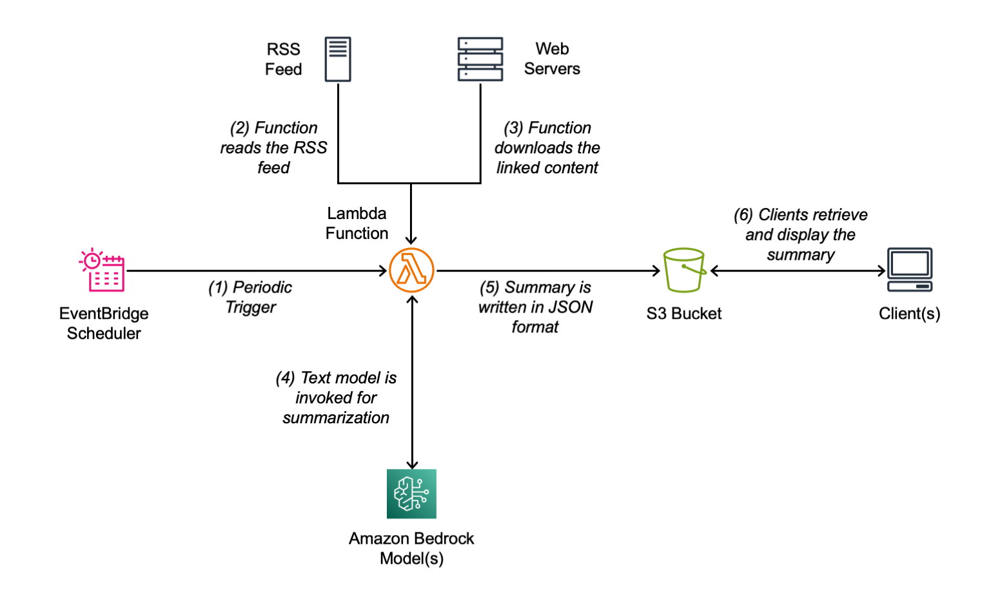

# Get the News – RSS/Atom Feed Summary

## Introduction

Do you want to get a summary of the most recent news from an RSS or Atom feed? Do you want to see them in Markdown format, in a Microsoft Word docuemnt, or on an e-ink device? Here's the tool for you.

## How does it work

This application is deployed as an AWS Lambda function. The function downloads the most recent entries from an RSS or Atom feed, downloads the linked content, extracts text, and makes a summary. The output is written in JSON format in an S3 bucket. The S3 object allows public reads so that it can be easily downloaded on an external device.

See instructions at the end for how run and test the Lambda function locally.

Here's an example of the structure of the JSON file:

```json
{
    "title": "Recent Announcements",
    "entries": [
        {
            "title": "Amazon SageMaker Model Registry announces support for private model repositories",
            "link": "https://...",
            "summary": "Amazon SageMaker Model Registry now supports..."
        },
        {
            "title": "Announcing memory optimized Amazon EC2 R7a bare metal instances",
            "link": "https://...",
            "summary": "Amazon announces general availability..."
        },
        ...
    ]
}
```

By default, the Lambda function is scheduled to run early in the day, Monday to Friday, to update the news.

The URL of the RSS feed, the cron schedule to run the function, and special instructions that can be added to the summarization prompt can be edited in the AWS SAM temnplate file (`template.yaml`).

## How to use it

First, edit the SAM template file (`template.yaml`):

- The default `RSS_LINK` points to the most recent AWS announcements.
- As an example, the links to the BBC and CNN top stories are provided but commented out.
- Only one `RSS_LINK` at a time can be used in the template.
- To run the function more or less often, edit the `ScheduleExpression` cron syntax between parenthesis.
- You can add `SPECIAL_INSTRUCTIONS` that are added to the prompt passed to the model. You can use these special instructions to tailor the summary to your needs.

Then, in the `sam-get-news` directory, build and deploy the application using this command:

```sh
sam build && sam deploy
```

Confirm the deployment when asked.

Get the News URL from the output of the `sam deploy` command.

You can download the JSON documls ent using `curl` or `wget` on the News URL. For example:

```sh
curl https://BUCKET-NAME.s3.REGION.amazonaws.com/news.json
```

## Display the news using Markdown, HTML, PDF, or Microsoft Word formats

In the `Markdown` directory, update the `NEWS_URL` in `markdown_news.py` file to the output of the `sam deploy` command.

Then, run the `run.sh` script to create news in multiple formats.

The `run.sh` script uses [Pandoc](https://pandoc.org) to convert the  Markdown output of the `markdown_news.py` script to HTML, Microsoft Word, and PDF. Follow the instructions on the Pandoc site to install the tool.

The PDF output is commented out by default in `run.sh` because it requires to install additional PDF tools.

## Using a Microcontroller (Raspebrry Pi Pico W) with an e-ink screen (2.13" black/white eInk/ePaper display from Waveshare) to display the news

Most of the MicroPython code in the `RaspberryPiPico` folder is specific to the e-ink display model. More information on the e-ink display can be found [here](https://www.waveshare.com/wiki/Pico-ePaper-2.13).

To deploy the script to the microcontroller, download the open source [Thonny Python IDE for beginners](https://thonny.org) for your operating system.

To allow the microcontroller to download the JSON file from the S3 bucket, you need to make that file public. To do so, you need to update the `template.yaml`` file.

First, add the following properties to the `NewsBucket`` resource (you AWS account might not allow this configuration):

```yaml
    Properties:
      PublicAccessBlockConfiguration:
        BlockPublicPolicy: false
        RestrictPublicBuckets: false
```

Then, add the following resource policy (the name and path of the file should be the same as in the `OUTPUT_FILE` environment variable):

```yaml
  NewsBucketPolicy:
    Type: AWS::S3::BucketPolicy
    Properties:
      Bucket: !Ref NewsBucket
      PolicyDocument:
        Statement:
          - Effect: Allow
            Principal: '*'
            Action: s3:GetObject
            Resource: !Sub 'arn:aws:s3:::${NewsBucket}/news.json'
```

Connect the Raspberry Pi Pico via USB to the laptop. Then, use the Thonny editor to copy and run the `display_news.py` MycroPython script on the device. In the script, update the URL of the `news.json` file and the name and password of the WiFi network the Raspberry Pi Pico W will to connect to download the file.

## Architectural diagram of the solution

This is the overall architectural flow of this tool:



1. A periodic trigger runs the Lambda function
2. The function reads the RSS feed
3. The function downloads the full content linked in the RSS feed
4. A text model is invoked using Amazon Bedrock to make a summary
5. The summary is written in JSON format in an S3 bucket
6. Clients can now retrieve and display the summary in different ways

## Testing from the command line

The code of the Lambda function can be run from the command line to simplify local testing.
To run the Lambda function locally, you need to create a virtual environment (`venv`) and install a few dependecies.

In the main directory of the project, create a virtual environemnt:

```sh
python3 -m venv .venv
```

In the `Lambda/sam-get-news/get-news` directory, install all dependencies:

```sh
pip3 install -r requirements.txt
```

Define the environment variable used by the Lambda function:

```sh
export RSS_LINK=https://aws.amazon.com/about-aws/whats-new/recent/feed/
export OUTPUT_BUCKET=<YOUR_BUCKET>
export OUTPUT_FILE=news.txt                                            
```

Now you can run the function locally:

```sh
python app.py
```

When the function teminates, you can see the output in the S3 bucket using the AWS CLI:

```sh
aws s3 cp s3://${OUTPUT_BUCKET}/${OUTPUT_FILE} - | more
```
